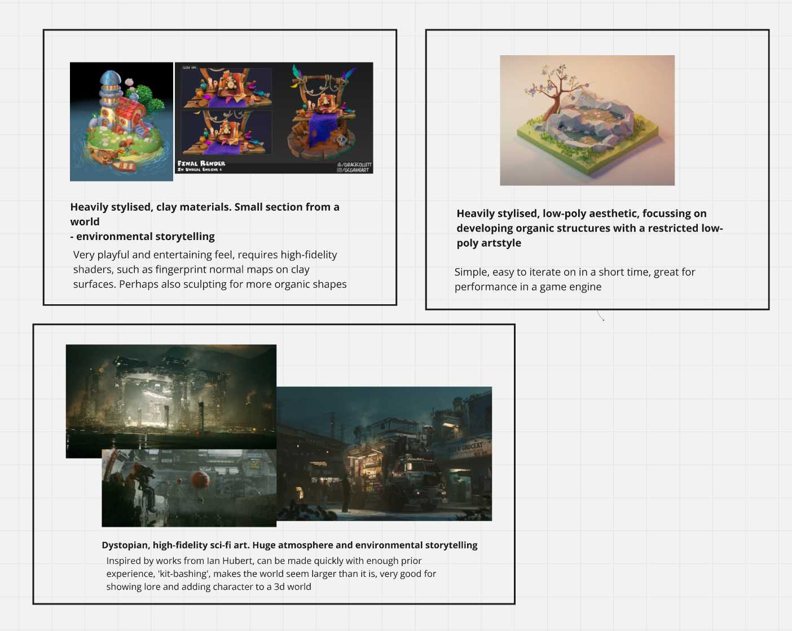
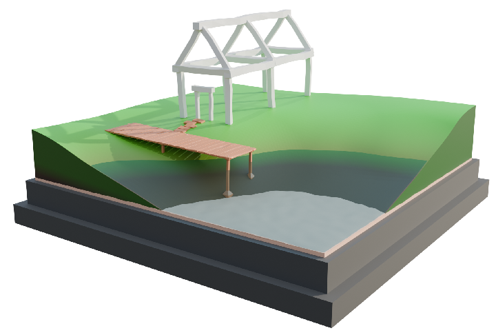

# Individual Game/3D World Practice

---

## Overview

**Stylised 3D diorama modelled in Blender and imported into Unity for use as a game environment**  
**Date Started: 26th September 2024**  
  
**Software Used:** Unity, Blender


---

## Table of Contents

- [Individual Game/3D World Practice](#individual-game3d-world-practice)
  - [Overview](#overview)
  - [Table of Contents](#table-of-contents)
  - [Introduction \& Goal](#introduction--goal)
  - [Concept and Inspiration](#concept-and-inspiration)
  - [Tools and Software](#tools-and-software)
    - [Blender](#blender)
    - [Unity](#unity)
    - [Miro](#miro)
  - [Modeling Process](#modeling-process)
    - [Step 1: Initial Concept and Sketches](#step-1-initial-concept-and-sketches)
    - [Step 2: Blocking Out the Environment](#step-2-blocking-out-the-environment)
    - [Step 3: Detailed Modeling](#step-3-detailed-modeling)
    - [Step 4: Shading, Texturing and UV Mapping](#step-4-shading-texturing-and-uv-mapping)
    - [Step 5: Lighting and Rendering](#step-5-lighting-and-rendering)
  - [Challenges Faced](#challenges-faced)
  - [Final Thoughts](#final-thoughts)
  - [References](#references)

---

## Introduction & Goal

This is my first individual project that I worked on during my enrolment at the University of Winchester. The brief for the project involved creating an original environment or diorama, in any 3d modelling software, that can be used in Unity to display the ability to design and create a game environment. 

## Concept and Inspiration

While the brief was being delivered, many ideas came into my head, some of which I had been wanting to create for a long time. I decided to draw inspiration from many artists such as [Alex Treviño][1], [Ian Hubert][2], [Polygon Runway][3] and [Grace Collett][4]. 

My methodology to developing my inspiration first involved gathering reference images, of artwork I liked, and deciding on which artstyle I should develop into my project. I listed what I liked about each artstyle, and why I think they would suit my project. At the same time as this, I was writing down ideas for the scene that I thought of during my research for inspiration and style, so I didn't forget them and so I could weigh the pros and cons of each scene.

My scene ideas and inspiration images were gathered together using [Miro](#miro). 
```
>city centre, tall buildings, circular park, homely, swingset
	> + calming, simpler blocking out 
	> + showcases building design
	> - large scale, perhaps too much detail to manage for a short project

>isolated field, pond, fishing, small wooden shack, character appears small in view
	> + focus on environment rather than character design
	> + interesting to me 
	> + particle system for grass, trees
	> + can be developed in both high and low fidelity art styles
	> + environmental storytelling
	
>isometric big city, heavily stylised cars driving
	> + satisfying render
	> + keyframed or procedural car movement
	> + explorable from ground-view in unity
	> - difficult to model detailed buildings & cars
	> - doesn't show a large variety of materials and structures
	> - not many organic elements

>dark, ian-hubert-esque but low-poly alleyway, dystopian neon lighting, character's stall selling something
	> + interesting to me
	> - high-fidelity, difficult to manage in a short time-frame
	> - big scope
```



After spending some time on this, I decided that my scene would be created using an artstyle that is a mixture of what is shown in the clay-styled references, and the low-poly reference: a low-fidelity, toon-like stylised diorama, with low-poly assets, but with a clay feel.

I then developed my ideas into my **final concept**: an isolated farmer's cottage with a pier leading into the middle of a pond. The farmer is sat alone with their legs hanging off of the pier, while fishing.

## Tools and Software

### Blender

I chose to use Blender as my primary 3D modelling and shading workspace, as I have a lot of experience working in the Blender workspace, since the release of Blender v2.8, and I feel comfortable using the modelling and shading tools provided. Coming into this project, I knew there would have been a lot of techniques used that I have never learned before, so I was eager to improve and expand my skillset along the way, and learn many techniques that are transferrable to other 3D modelling programs.

### Unity

A requirement for the brief was that the resulting environment was imported into Unity, and explorable by a player character. Therefore, I chose to use Unity 2022.3.47f1, as that was the most recent LTS package at the time of starting the project. I was familiar with the program before this project, however I expected to run into a lot of challenges and roadblocks along the way, learning how to navigate them and result in an expanded skillset, suitable for game development.

### Miro

Miro is an online interactive whiteboard/note-taking app, used widely in industry and I chose to use it for the first time with this project, to gather my ideas and inspiration in a manageable and shareable format, ideal for showing how and why I developed my ideas.

## Modeling Process

### Step 1: Initial Concept and Sketches

To begin sketching and expanding on my concept, I first researched real-world examples of buildings and piers in a similar setting and style to what I desired and envisioned.


I then used the references to quickly sketch a base layout for my scene, by using the grease pencil in Blender, and sketching a very simple layout in the camera viewport. I spent a short amount of time on this sketch, I refined it until I was happy with the composition, and then quickly moved onto blocking out - as I find blocking out to be a much better way at developing and prototyping my ideas in a 3D space. 


### Step 2: Blocking Out the Environment

After I was happy with the overall composition, I quickly started blocking out the scene. My favourite way to create ideas is to rapidly ideate, sketch, block out, and iterate. This methodology helps me create my best possible ideas, and follows conventions in [Design Thinking][5] practice.

To block out the scene, I kept my sketch and my references open in a [Miro](#miro) whiteboard on my second monitor, and placed primitives in the viewport to establish the relative size, location, and form of the main objects in the scene. I didn't adhere strictly to the sketch, as I wanted to ensure the piece could successfully evoke a feeling of isolation while also giving the feeling of looking *into* a small piece of another world, all in an aesthetically pleasing form.

> **Primitivees** <br>
> Basic 3D geometric shapes that can be used as building blocks to create more complex shapes, for example: cubes, spheres, cylinders and planes.

I added basic shaders to my block out, to better represent the world I was creating.


After my first blocking out of the scene, I decided to make some key changes that would influence the overall direction of the project.

- **Cut out a smaller square from the scene** <br> The environment was to be explored in a 3D world, so Having the edges off into the distance with a fixed cut-off would break all sense of it being a section from a lived-in world. My first block out was designed to fit a fixed camera angle, but I reworked it to better fit the brief and expectations of the project.
- **Moved the primary camera angle** <br> The scene draws inspiration from isometric dioramas, so I moved the camera to outside of the scene, looking down. This helped to better establish the feeling of 'looking into' a world.
- **Built an organic timber frame model for the house** <br> I built a timber frame for the house, as my concept involved an old stone cottage with a timber frame, so I quickly threw together what I imagined the base layout of the house to be.




### Step 3: Detailed Modeling

My first stage to beginning the detailed modelling stage was to review the previous block outs, and add notes as to what I would like to see improved and added, to establish a set list of goals and ensure that I could fit everything into the time I had to spend on this project.


I began by making a new .blend file, and modelling the ground from scratch. I began with a plane which I subdivided, and edited in the Z-axis with proportional editing, to create a smooth, organic hill shape, with a deep area for the water to sit. To create the flat sides, I extruded the outer corners down in the Z-axis, made them level with each other with the keystrokes
> **S, Z, 0** <br> Scale, Z - axis, 0

Then, I used the F key to join them together in to a flat base. Finally, I held the Alt key, and selected the loop around each side, and pressed F again, to fill in each of the four side faces of the ground mesh. This left me with n-gons for the sides, however the mesh is intended to be entirely static, and not deformed, additionally, the wall is completely flat. Therefore, I expected there to be no issue with leaving them as n-gons.

> **N-Gons** <br>
> Polygons with more than four vertices and edges. They are avoided in most cases, as they can cause issues when rendering or deforming a mesh. 


### Step 4: Shading, Texturing and UV Mapping

Discuss the texturing process, including how you unwrapped the UVs and applied textures to the models.

### Step 5: Lighting and Rendering

Outline the lighting setup and rendering process. Mention any techniques used to enhance the visual quality of the environment.

## Challenges Faced

Describe any challenges encountered during the modeling process and how they were overcome.

## Final Thoughts

Provide a concluding section with your reflections on the project. Mention what you learned and how it will influence future projects.

## References

[1]: https://www.aendom.com/
[2]: https://www.instagram.com/ianhubertz/
[3]: https://polygonrunway.com/
[4]: https://www.instagram.com/gcgameart/

---

